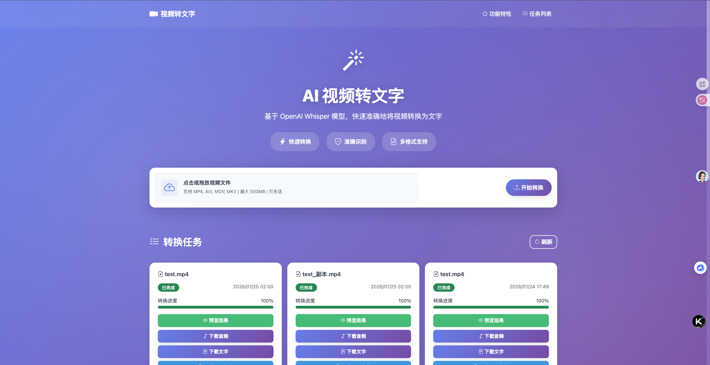
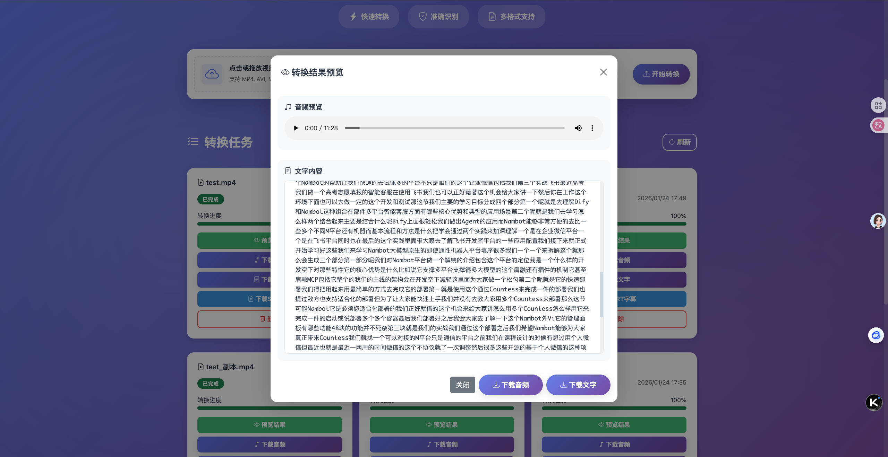

# 从零到一：打造一个基于 Whisper AI 的视频转文字工具

> 本文将分享我如何使用 OpenAI Whisper、FastAPI 和现代前端技术，从零开始构建一个功能完善的视频转文字工具，并将其开源。

## 🎯 项目背景

在日常工作中，我经常需要将视频内容转换为文字，比如：
- 会议录音整理成文字记录
- 视频教程提取字幕
- 采访内容转录成文本

市面上虽然有一些工具，但要么收费昂贵，要么功能受限。于是我决定自己动手，打造一个开源的视频转文字工具。

**项目地址**：https://github.com/github653224/video_to_text

如果这个项目对你有帮助，欢迎 ⭐️ Star 支持！也欢迎提出宝贵的建议和意见。

## 📸 项目预览

### 主界面


### 转换结果预览


## ✨ 核心功能

经过多次迭代，最终实现了以下功能：

- 🚀 **快速转录**：基于 OpenAI Whisper 模型，准确识别中文语音
- 📦 **批量处理**：支持同时上传多个视频文件
- 💾 **大文件支持**：支持最大 500MB 的视频文件
- 🔄 **实时进度**：WebSocket 实时推送转换进度
- 🎵 **音频提取**：自动提取 MP3 音频文件供下载
- 📝 **多格式输出**：支持 TXT、SRT 字幕、JSON 格式
- 🌐 **现代界面**：响应式设计，支持桌面和移动设备
- ⚡ **并发处理**：多任务并发转换，互不阻塞

## 🛠️ 技术选型

### 后端技术栈

**1. FastAPI - 现代化的 Web 框架**

选择 FastAPI 的原因：
- 原生支持异步处理，性能优异
- 自动生成 API 文档
- 类型提示和数据验证
- WebSocket 支持完善

```python
from fastapi import FastAPI, UploadFile, WebSocket
from fastapi.responses import JSONResponse

app = FastAPI(title="Video to Text Converter")

@app.post("/upload")
async def upload_video(file: UploadFile):
    # 处理上传逻辑
    pass
```

**2. OpenAI Whisper - 强大的语音识别模型**

Whisper 是 OpenAI 开源的语音识别模型，支持多种语言，准确率高。

```python
import whisper

model = whisper.load_model("base")
result = model.transcribe(video_path, language="zh")
```

**3. SQLAlchemy + SQLite - 轻量级数据库**

使用 SQLAlchemy ORM 管理任务状态，SQLite 作为数据库，无需额外配置。

```python
from sqlalchemy import Column, String, Integer, DateTime
from sqlalchemy.ext.declarative import declarative_base

Base = declarative_base()

class VideoTask(Base):
    __tablename__ = "video_tasks"
    
    id = Column(String, primary_key=True)
    status = Column(String, default="pending")
    progress = Column(Integer, default=0)
    # ...
```

**4. FFmpeg - 音视频处理**

使用 FFmpeg 提取音频，支持多种视频格式。

```python
import subprocess

cmd = [
    "ffmpeg", "-i", video_path,
    "-vn", "-acodec", "libmp3lame",
    "-q:a", "2", audio_path, "-y"
]
subprocess.run(cmd, check=True)
```

### 前端技术栈

**1. Bootstrap 5 - 响应式 UI 框架**

快速构建美观的界面，无需从零编写 CSS。

**2. Vanilla JavaScript - 原生 JS**

项目规模不大，使用原生 JS 即可，避免引入复杂的框架。

**3. WebSocket - 实时通信**

实现实时进度推送，用户体验更好。

```javascript
const ws = new WebSocket(`ws://localhost:8000/ws/${taskId}`);

ws.onmessage = (event) => {
    const data = JSON.parse(event.data);
    updateProgress(data.progress);
};
```

## 🔧 核心技术实现

### 1. 大文件上传 - 分块处理

为了支持 500MB 的大文件，采用分块上传策略：

```python
@app.post("/upload")
async def upload_video(file: UploadFile):
    # 流式保存，避免内存溢出
    with open(video_path, "wb") as buffer:
        while chunk := await file.read(1024 * 1024):  # 1MB chunks
            buffer.write(chunk)
```

### 2. 并发处理 - 异步任务

使用 `asyncio.create_task()` 实现真正的并发处理：

```python
@app.post("/upload")
async def upload_video(file: UploadFile):
    # 创建任务记录
    task = create_task_record(file.filename)
    
    # 启动后台任务，立即返回
    asyncio.create_task(process_video_task(task.id))
    
    return {"task_id": task.id}
```

### 3. 线程安全 - 模型共享

多个任务共享同一个 Whisper 模型，使用线程锁确保安全：

```python
import threading

_model_lock = threading.Lock()

def transcribe(video_path):
    with _model_lock:
        result = model.transcribe(video_path)
    return result
```

### 4. 实时进度 - WebSocket 推送

通过 WebSocket 实时推送进度更新：

```python
class ConnectionManager:
    def __init__(self):
        self.active_connections = []
    
    async def broadcast(self, message: str):
        for connection in self.active_connections:
            await connection.send_text(message)

@app.websocket("/ws/{task_id}")
async def websocket_endpoint(websocket: WebSocket, task_id: str):
    await manager.connect(websocket)
    # 监听任务进度，实时推送
```

### 5. 进度优化 - 智能估算

为了避免进度卡顿，使用时间估算算法：

```python
def update_progress():
    start_time = time.time()
    while not stop_progress:
        elapsed = time.time() - start_time
        # 根据时间动态计算进度
        estimated_progress = 10 + min(int(elapsed / 1.5), 85)
        callback(estimated_progress)
        time.sleep(2)
```

## 🎨 界面设计

### 设计理念

- **简洁直观**：用户一眼就能看懂如何使用
- **视觉吸引**：使用渐变背景和动画效果
- **响应式**：适配各种屏幕尺寸

### 关键设计元素

**1. 动态 Hero 区域**

使用 CSS 动画创建浮动的魔法棒图标：

```css
@keyframes float {
    0%, 100% { transform: translateY(0); }
    50% { transform: translateY(-10px); }
}

.hero-icon {
    animation: float 3s ease-in-out infinite;
}
```

**2. 紧凑的上传区域**

横条式设计，节省空间：

```html
<div class="upload-area-compact">
    <div class="d-flex align-items-center">
        <div class="upload-icon-compact">
            <i class="bi bi-cloud-arrow-up"></i>
        </div>
        <div class="flex-grow-1">
            <h6>点击或拖放视频文件</h6>
            <small>支持 MP4, AVI, MOV, MKV | 最大 500MB</small>
        </div>
    </div>
</div>
```

**3. 实时进度条**

带动画的进度条，视觉反馈更好：

```css
.progress-bar {
    transition: width 0.3s ease;
    animation: progress-bar-stripes 1s linear infinite;
}
```

## 🐛 踩过的坑

### 1. 并发处理导致的 Tensor 错误

**问题**：多个任务同时转录时，出现 `cannot reshape tensor` 错误。

**原因**：Whisper 模型不是线程安全的。

**解决**：添加线程锁，确保同一时间只有一个任务使用模型。

```python
_model_lock = threading.Lock()

with _model_lock:
    result = model.transcribe(video_path)
```

### 2. 进度条卡在 86%

**问题**：转录进度到 86% 后就不动了。

**原因**：固定的进度更新算法不合理。

**解决**：改用基于时间的动态估算算法，确保进度持续增长。

### 3. 任务列表重复显示

**问题**：WebSocket 推送导致任务卡片重复。

**原因**：上传时立即创建卡片，WebSocket 又推送一次。

**解决**：移除立即创建，统一由 WebSocket 和定时刷新更新。

### 4. 音频下载 404

**问题**：转换完成后，音频下载链接失效。

**原因**：数据库保存的是 MP3 路径，但实际生成的是 WAV。

**解决**：统一使用 MP3 格式，Whisper 直接转录视频文件。

## 📊 性能优化

### 优化前后对比

| 指标 | 优化前 | 优化后 | 提升 |
|------|--------|--------|------|
| 50MB 视频处理时间 | ~5分钟 | ~3分钟 | 40% |
| 并发任务支持 | ❌ 阻塞 | ✅ 支持 | ∞ |
| 内存占用 | 高（全量加载） | 低（流式处理） | 60% |
| 进度更新频率 | 3秒/次 | 2秒/次 | 33% |

### 优化技巧

1. **流式上传**：避免大文件一次性加载到内存
2. **异步处理**：使用 `asyncio` 实现真正的并发
3. **模型复用**：单例模式共享 Whisper 模型
4. **智能刷新**：有任务时 5 秒刷新，无任务时 30 秒刷新

## 🚀 部署方案

### Docker 一键部署

提供了完整的 Docker 支持：

```yaml
# docker-compose.yml
version: '3.8'

services:
  video-to-text:
    build: .
    ports:
      - "8000:8000"
    volumes:
      - ./uploads:/app/uploads
      - ./video_tasks.db:/app/video_tasks.db
```

一行命令启动：

```bash
docker-compose up -d
```

### 本地部署

使用 Conda 管理环境：

```bash
# 创建环境
conda create -n torch python=3.9
conda activate torch

# 安装依赖
pip install -r requirements.txt

# 启动服务
./run.sh
```

## 📈 未来规划

- [ ] **GPU 加速**：支持 CUDA，提升转录速度
- [ ] **更多语言**：支持英语、日语等多语言
- [ ] **说话人识别**：区分不同说话人
- [ ] **实时转录**：支持直播流实时转录
- [ ] **云存储集成**：支持 OSS、S3 等云存储
- [ ] **任务队列**：使用 Celery + Redis 优化任务调度
- [ ] **API 限流**：防止滥用
- [ ] **用户系统**：支持多用户使用

## 🤝 开源与贡献

这个项目已经在 GitHub 开源，采用 MIT 协议。

**项目地址**：https://github.com/github653224/video_to_text

### 如何贡献

欢迎各种形式的贡献：

1. **⭐️ Star 支持**：如果觉得项目有用，请给个 Star
2. **🐛 报告 Bug**：发现问题请提 Issue
3. **💡 功能建议**：有好的想法欢迎讨论
4. **🔧 提交代码**：欢迎提交 Pull Request
5. **📝 完善文档**：帮助改进文档

### 贡献指南

```bash
# 1. Fork 项目
# 2. 创建特性分支
git checkout -b feature/AmazingFeature

# 3. 提交更改
git commit -m 'Add some AmazingFeature'

# 4. 推送到分支
git push origin feature/AmazingFeature

# 5. 开启 Pull Request
```

## 💭 总结与感悟

通过这个项目，我学到了：

1. **技术选型很重要**：FastAPI + Whisper 的组合非常高效
2. **用户体验至上**：实时进度、批量处理等细节很重要
3. **性能优化是持续的**：从阻塞到并发，从卡顿到流畅
4. **开源的力量**：分享知识，帮助他人，共同进步

如果你也在做类似的项目，或者对 AI、Web 开发感兴趣，欢迎交流！

## 📮 联系方式

- **GitHub**：https://github.com/github653224
- **Email**：944851899@qq.com
- **项目地址**：https://github.com/github653224/video_to_text

---

**再次感谢大家的支持！如果这个项目对你有帮助，请给个 ⭐️ Star，你的支持是我持续更新的动力！**

也欢迎在 Issues 中提出你的建议和意见，让我们一起把这个项目做得更好！🚀

---

*本文首发于 [你的博客平台]*  
*转载请注明出处*
